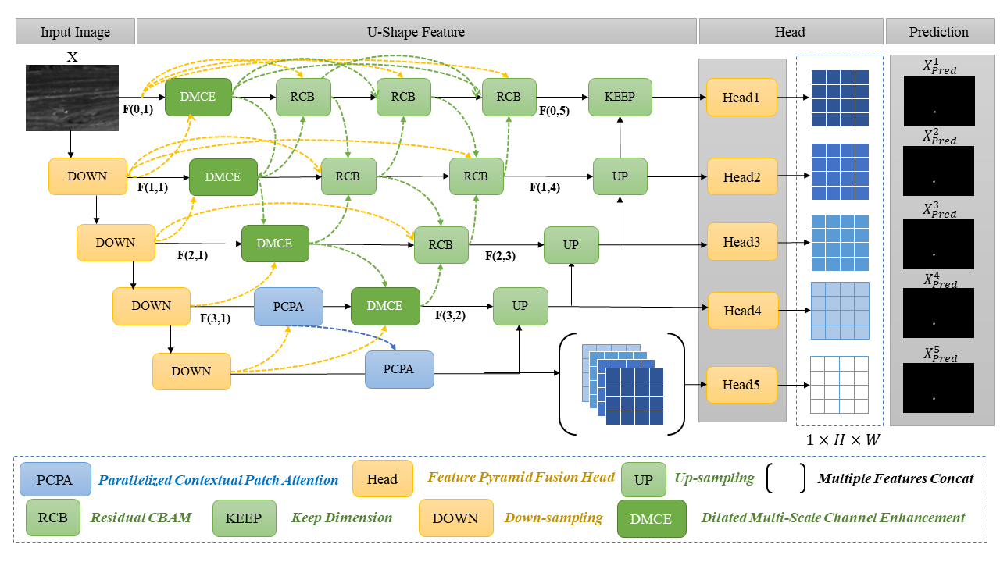
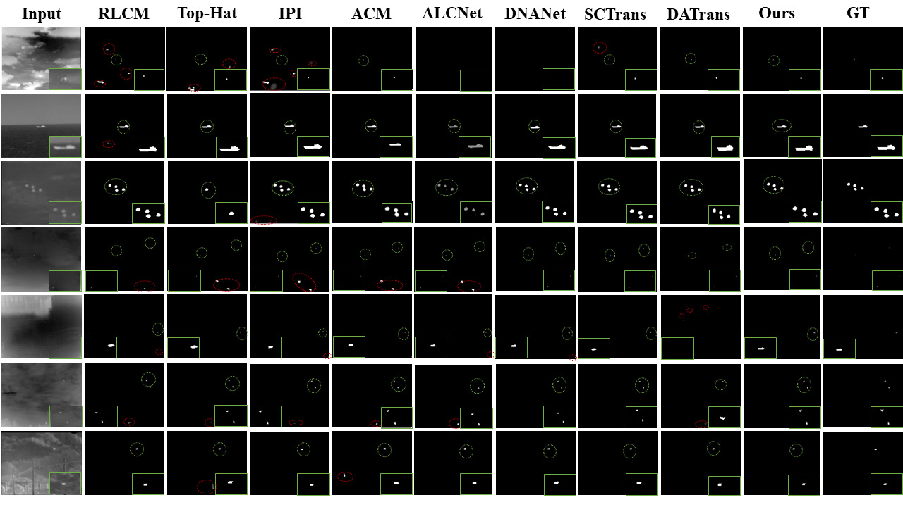
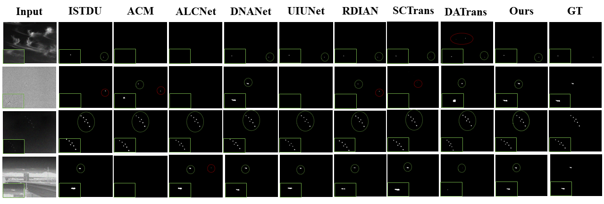

# MDNANet: Transformer-Enhanced Multi-scale Dense Nested Attention Networks for Infrared Small Target Detection




---

## 🔍 Algorithm Introduction  
In this work, we propose **MDNANet (Multi-scale Dense Nested Attention Network)**, which builds upon DNANet by introducing **PCPA** and **DMCE** modules:

1. **Parallel Context-Block Attention (PCPA):** Enhances contextual feature interactions across multiple receptive fields.  
2. **Dilated Multi-Channel Encoder (DMCE):** Expands feature representation while maintaining efficiency.  
3. **Cross-scene Generalization:** Validated on **SIRST-v1**, **NUST-SIRST**, **IRSTD-1K**, and our **augmented NAB-SIRST dataset**, achieving strong robustness across diverse infrared scenes.  

Our contributions are:  
- 🚀 A novel architecture (MDNANet) for single-frame IR small target detection.  
- 📊 Comprehensive ablations demonstrating effectiveness of each module.  
- 🌍 Benchmarking across multiple public and augmented datasets.  

---

## 📂 Dataset Introduction  

We evaluate on multiple **SIRST (Single-frame Infrared Small Target)** datasets:  

- **SIRST-v1** [[download]](https://github.com/YimianDai/sirst) [[paper]](https://ieeexplore.ieee.org/document/9058096)
- **NUDT-SIRST** [[download]](https://github.com/wanghuanphd/MDvsFA_cGAN) [[paper]](https://ieeexplore.ieee.org/document/9353139)
- **IRSTD-1K** [[download dir]](https://github.com/RuiZhang97/ISNet) [[paper]](https://ieeexplore.ieee.org/document/9664615)
- **NAB-SIRST (ours)** [[download]](https://pan.baidu.com/s/1ANOtQmkzTig6JexNDWOE6Q?pwd=smd5)

Each dataset contains **infrared small targets with diverse cluttered backgrounds**, annotated at pixel-level for supervised training.

---

## ⚙️ Prerequisite  

- **OS:** Ubuntu 18.04 / Windows 10  
- **Python:** 3.8+  
- **Framework:** PyTorch ≥ 1.7, Torchvision ≥ 0.8  
- **CUDA:** 10.2+  
- **GPU:** NVIDIA 1080Ti / 4060 (single GPU is sufficient)  


## 🚀 Usage  

### 1. Train  

```bash
python train.py \
  --base_size 256 \
  --crop_size 256 \
  --epochs 400 \
  --dataset [dataset-name] \
  --split_method 80_20 \
  --model MDNANet \
  --backbone resnet_18 \
  --deep_supervision True \
  --train_batch_size 16 \
  --test_batch_size 16 \
  --mode TXT
```

### 2. Test  

获取权重文件的百度网盘链接：[链接](https://pan.baidu.com/s/1JCCAvCEjzMkne55XxxNGsA?pwd=6trf)

```bash
python test.py \
  --base_size 256 \
  --crop_size 256 \
  --st_model [trained model path] \
  --model_dir [checkpoint path] \
  --dataset [dataset-name] \
  --split_method 80_20 \
  --model MDNANet \
  --backbone resnet_18 \
  --deep_supervision True \
  --test_batch_size 1 \
  --mode TXT
```

#### (Optional 1) Visulize your predicts.
```bash
python visulization.py \
  --base_size 256 \
  --crop_size 256 \
  --st_model [trained model path] \
  --model_dir [checkpoint path] \
  --dataset [dataset-name] \
  --split_method 80_20 \
  --model MDNANet \
  --backbone resnet_18 \
  --deep_supervision True \
  --test_batch_size 1 \
  --mode TXT
```

#### (Optional 2) Test and visulization.
```bash
python test_and_visulization.py \
  --base_size 256 \
  --crop_size 256 \
  --st_model [trained model path] \
  --model_dir [checkpoint path] \
  --dataset [dataset-name] \
  --split_method 80_20 \
  --model MDNANet \
  --backbone resnet_18 \
  --deep_supervision True \
  --test_batch_size 1 \
  --mode TXT
```

## 📊 Results  

### Quantitative Results (example, replace with your real results)

| Dataset      | Model     | mIoU (%)  |   Pd (%)  |Fa (×10^-6)|
|--------------|-----------|-----------|-----------|-----------|
| SIRST-v1     | MDNANet   | **77.17** | **95.66** | **4.066** |
| NUDT-SIRST   | MDNANet   | **92.19** | **99.73** | **2.528** |
| IRSTD-1K     | MDNANet   | **70.36** | **95.27** | **11.28** |
| NAB-SIRST    | MDNANet   | **77.41** | **97.61** | **13.24** |

### Qualitative Results  



### Qualitative Results On NAB-SIRST




---

## 🙏 Acknowledgement  
This code is built upon DNANet [[code]](https://github.com/YeRen123455/Infrared-Small-Target-Detection) [[paper]](https://arxiv.org/abs/2106.00487). Thanks to the authors for their great work.  
